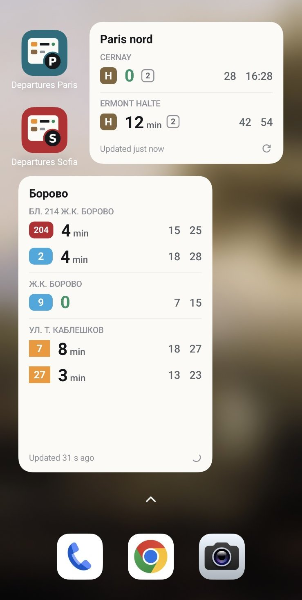
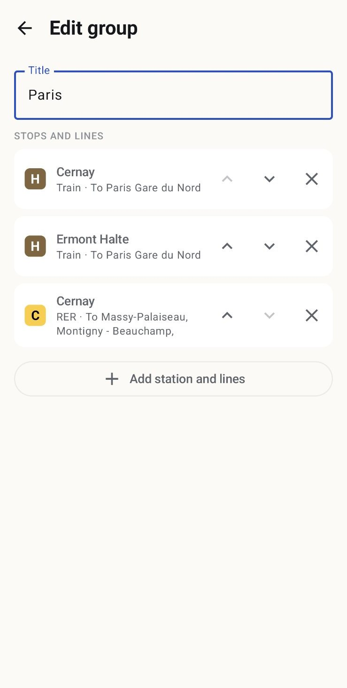
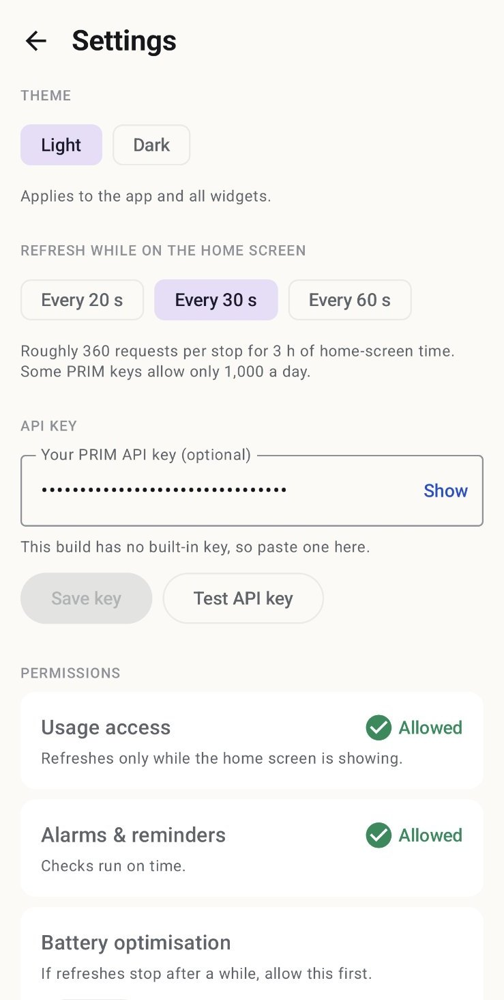

# Departures

Two small Android apps that put **live public-transport departures on your home screen**, one
widget per group of stops and lines you choose. Both are personal, sideloaded apps (never on
the Play Store) and can be installed side by side.

| Folder | App | City | Data | Key needed |
|---|---|---|---|---|
| [`paris/`](paris) | **Departures Paris** | Île-de-France: metro, RER, Transilien, tram, bus | IDFM PRIM real-time API (official) | Yes, free PRIM key |
| [`sofia/`](sofia) | **Departures Sofia** | Sofia: bus, trolleybus, tram, metro | sofiatraffic.bg stop boards (unofficial) + official GTFS stop list | No |

<p align="center">
  
</p>

*Both apps on one phone. Top: **Departures Paris**. Line H at Cernay is at the platform (pulsing
`0`, platform `[2]`); later trains in 28 min and at 16:28. Bottom: **Departures Sofia**, with three
stops in one group, each line in its own colour.*

## Download

Ready-to-install builds, at the root of this repo:

| App | File | Size |
|---|---|---|
| Departures Paris | [**Departures-Paris.apk**](Departures-Paris.apk) | ~17 MB |
| Departures Sofia | [**Departures-Sofia.apk**](Departures-Sofia.apk) | ~17 MB |

On GitHub, open the file and click **Download raw file** (⤓).

**Installing on the phone:**

1. Open the downloaded APK (from Files, Chrome downloads, Drive…).
2. Android asks to allow **Install unknown apps** for that app. Allow it once, then tap **Install**.
3. Open the app; it walks you through the permissions. Then long-press the home screen →
   **Widgets** → **Departures · Paris** / **Departures · Sofia**.

**Notes:**

- **Paris needs your own API key.** This APK has none built in. Get a free key at
  <https://prim.iledefrance-mobilites.fr>, then paste it in **Settings → API key** and tap
  **Test API key**. Sofia needs no key.
- **Updates keep your data.** Both are signed with the committed debug keystore, so a newer APK
  installs over the old one and keeps your groups and widgets.
- **These are debug builds** for personal use. To make fresh ones, see
  [Updating the APKs](#updating-the-apks).

## Screenshots

<table>
  <tr>
    <td align="center" width="50%"></td>
    <td align="center" width="50%"></td>
  </tr>
  <tr>
    <td align="center"><b>Edit a group.</b> Each entry is a stop, a line and its directions
      ("To Paris Gare du Nord"). Reorder with the arrows; the widget follows the same order.</td>
    <td align="center"><b>Settings.</b> Theme, refresh interval, your own API key (Paris) with a
      test button, and the status of the three permissions the refresh loop needs.</td>
  </tr>
</table>

## What they have in common

- **Same widget:**
  - the next departure large and bold, the 2nd and 3rd quieter
  - a pulsing `0` when it's arriving
  - a clock time from 60 minutes away
  - resizes from 1 row to full height
  - light or dark
- **Same refresh strategy:** fetch only while the home screen is showing, one request per stop,
  backoff on errors, cached so widgets redraw instantly.
- **Same setup flow:** search a stop, then pick the lines and the directions.
- **Same icon base**, told apart by a **P** (teal) or **S** (red) tag, also in Android 13+ themed icons.

Each folder is a **standalone Gradle project** with its own README, spec, docs and tests. Open
the folder (not the repo root) in Android Studio.

## Quick start

```bash
# Paris: put your PRIM key in paris/local.properties first: IDFM_API_KEY=...
cd paris && ./gradlew installDebug

# Sofia: nothing to configure
cd sofia && ./gradlew installDebug
```

On Windows, use `gradlew.bat`. Requirements: JDK 17 and the Android SDK (Android Studio installs
both). Phone setup and permissions are explained in each app's README.

## Repository layout

```
paris/   Departures Paris: README, SPEC.md (the original brief), docs/, app/, tools/icon/
sofia/   Departures Sofia: README, SPEC.md (inherited Paris brief), docs/sofia-app-spec.md, app/, tools/icon/
```

## Updating the APKs

After changing code, rebuild and replace the root files:

```bash
cd paris && ./gradlew assembleDebug && cp app/build/outputs/apk/debug/app-debug.apk ../Departures-Paris.apk && cd ..
cd sofia && ./gradlew assembleDebug && cp app/build/outputs/apk/debug/app-debug.apk ../Departures-Sofia.apk && cd ..
```

Before committing `Departures-Paris.apk`, make sure `paris/local.properties` has **no**
`IDFM_API_KEY` line, or the key would be built into the APK. Temporarily remove the line, or build
from a clean checkout. Users enter their key in the app instead.

## Never committed

The `.gitignore` files keep these out of git: `local.properties` (the Paris API key), APKs
(except the two keyless builds at the root), build output, IDE files, and phone screenshots. Both apps are signed with the committed debug keystore
(`app/debug.keystore`, no secrets), so a new build installs over the old one and keeps your groups.
